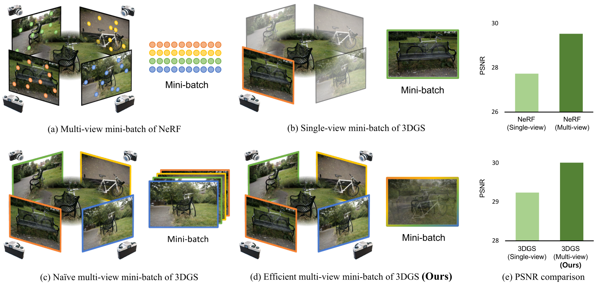

# PED — Paper Explain with Documentation

<p align="center">
  
  
  
  
</p>

<p align="center">
  <b>Clean, educational implementations of influential AI papers</b><br/>
  with structured explanations and experiments
</p>

---

Welcome to **PED (Paper Explain with Documentation)** — a curated collection of
well-documented implementations of important Artificial Intelligence papers,
built for **learning, experimentation, and clarity**.

📢 <b>Telegram Channel:</b> https://t.me/paperExplainWithDocumentation

> 🎥 <b>Note:</b> Most long-form explanations and videos are in <b>Farsi (Persian)</b>.

---

## 📚 Implemented Papers

### 🧠 Reasoning & Generalization

#### 🔹 [Hierarchical Reasoning Model (HRM)](./HRM)

A hierarchical architecture for complex reasoning and planning tasks, capable of
solving **Sudoku** and **ARC-style** problems.

<p align="center">
  
</p>

#### 🔹 [Grokking](./grokking)

An exploration of **generalization beyond overfitting** on small algorithmic
datasets.


---

### 🌟 Computer Vision & Graphics

#### 🔹 [3D Gaussian Splatting (3DGS)](./3DGS)

Real-time radiance field rendering using 3D Gaussian primitives.



#### 🔹 [Neural Radiance Fields (NeRF)](./NeRF)

Representing scenes as continuous neural radiance fields for novel view synthesis.


#### 🔹 [ResNet (Residual Networks)](./ResNet)

Deep Residual Learning for Image Recognition — solving the vanishing gradient
problem using skip connections.


#### 🔹 [Inception (GoogLeNet)](./Inception)

“Going Deeper with Convolutions” — efficient deep CNN architectures via
multi-scale feature extraction.


---

## 🛠️ Installation

```bash
git clone https://github.com/ali-hamedi/PED.git
cd PED
pip install torch torchvision numpy matplotlib jupyter
```

For **HRM**:

```bash
pip install -r HRM/requirements.txt
```

---

## 🚀 Usage

Most implementations are provided as **Jupyter notebooks** for interactive
experimentation.

```bash
cd NeRF
jupyter lab nerf.ipynb
```

---

## 🤝 Contributing

Contributions are welcome.

- Open an **issue** if you find a bug, broken link, or want a paper implemented.
- Feel free to submit a **pull request** with improvements (cleanup, speedups, docs, etc.).
- Keep implementations **educational and readable** (clear variable names, comments, minimal “magic”).

If your change adds new dependencies, please update the relevant \`requirements.txt\` (or document it in that folder’s README).

---

<p align="center">
  <sub>Created with ❤️ by Ali Hamedi</sub>
</p>
